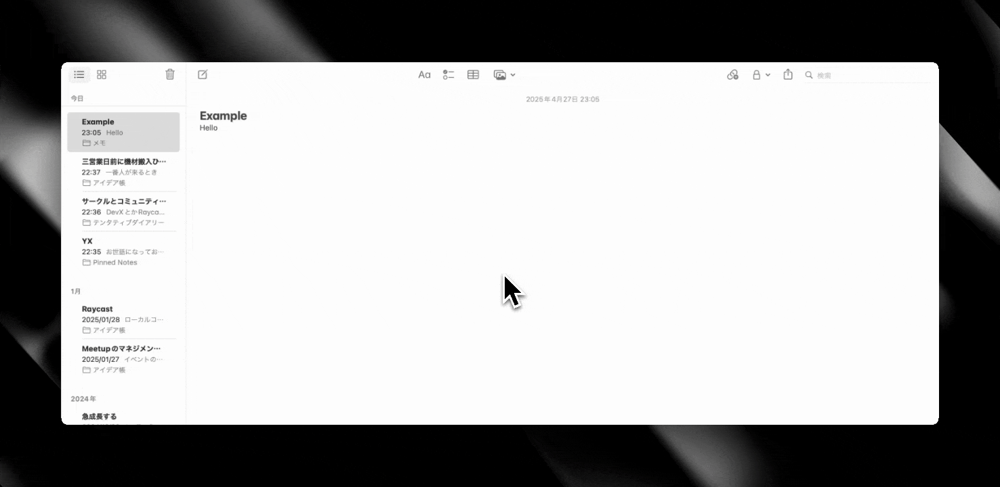

# Superwhisper Integrations

Extend Superwhisper posibilities with Raycast

## demo



## Integration Features

Superwhisper can be integrated with various external services to enhance its functionality.

### Supported Integrations

- **Apple Notes**
  - Automatically saves transcriptions of recordings to Apple Notes
  - Requires an iCloud account

- **Slack**
  - Posts transcriptions to a Slack channel
  - Requires Bot Token and Channel ID configuration

- **Email**
  - Sends transcriptions via email
  - Requires SMTP server configuration

### Configuration

1. Create a `.env` file with the following environment variables:

```env
# Slack Configuration
SLACK_BOT_TOKEN=your_bot_token
SLACK_CHANNEL_ID=your_channel_id

# Email Configuration(gmail)
MAIL_FROM=your_email@example.com
MAIL_TO=recipient@example.com
MAIL_USER=your_smtp_username
MAIL_PASS=your_smtp_password
```
MAIL_PASS will be app password. please check [this doc](https://doc.gravio.com/manuals/gravio4/1/ja/topic/gmail)

2. Configure the recordings directory:
   - Update the `RECORDINGS_DIR` path in `check-superwhisper-recording.js` to match your setup

3. Run the script:
```sh
node demo/check-superwhisper-recording.js
```

### How It Works

1. Periodically checks the Superwhisper recordings directory
2. Detects new recordings
3. Retrieves transcription data (llmResult)
4. Automatically sends to configured destinations (Notes/Slack/Email)

*Note: On first run, it uses the latest existing recording as a baseline; after that, only new recordings are processed automatically.*

### How to use check-superwhisper-recording.js

Automatically detects new SuperWhisper audio recordings and saves their transcriptions (llmResult) as new notes in the Apple Notes app.
Run this script as a Raycast script command or directly with Node.js.
On the first run, it uses the latest existing recording as a baseline; after that, only new recordings are processed automatically.

- Please update the SuperWhisper recordings directory (RECORDINGS_DIR) as needed.
- Make sure your Apple Notes app is set up with an iCloud account.

Example usage:
```sh
node demo/check-superwhisper-recording.js
```

You can use it via [Script Commands](https://manual.raycast.com/script-commands)
